# Deloo user flows (mobile app)

**Status:** v1, 9 Oct 2026. UX research draft for page-by-page design.
**Sources:** `README.md`, `PRD.md`, `docs/native-app-plan.md`, the N0 app shell in `mobile/src/app/`.
**Screen IDs:** the canonical inventory (A1–A6, R1–R29, V1–V18). IDs are never renumbered. Additions are in §8 and
are marked *(proposed)* wherever they appear in a flow.

> **Research caveat.** No Lagos users have been interviewed for this document yet. The personas are
> *proto-personas*: assumptions drawn from the PRD, the founder's network and known Lagos patterns. §7 lists the
> assumptions that would hurt most if wrong, with a cheap test for each. Treat this document as the hypothesis we
> test, not as findings.

---

## Contents

1. Personas and jobs to be done
2. Cross-cutting rules (apply to every flow)
3. Flows F1–F17 (goal, entry points, steps, decisions, exits, unhappy paths, diagram)
4. Master navigation map and deep links
5. Screen inventory with states
6. Prioritisation: demo, pilot, later
7. Top 10 UX risks and assumptions to validate
8. Proposed changes to the inventory

---

## 1. Personas and jobs to be done

### P1. Tunde, church media lead (primary renter)

| | |
|---|---|
| **Who** | 29, leads a volunteer media team at a 1,500-member church in Ikeja. Day job in IT support. |
| **Device and data** | Tecno Camon (Android 13, 128 GB, storage often full of WhatsApp media). Buys a weekly MTN bundle (about ₦3,000); turns data off to save it. Signal is weak inside the church hall. |
| **App literacy** | High for WhatsApp, Opay/Moniepoint, YouTube Studio, OBS. Low patience for forms. Types in English, talks in English and Pidgin. |
| **Context** | Sizes gear for the Sunday service and 3–4 special programmes a year (crusade, harvest, convention). He is not the payer: the church admin or a pastor approves spending, usually after he forwards a WhatsApp quote. |
| **Fears** | Sound or screen failing mid-service in front of the pastor. Paying a deposit to a vendor who disappears. Being blamed for damage he didn't cause. Getting "a mic and a speaker" that can't reach the back of an open field. |
| **Jobs** | *When we have a special programme, help me know what gear we need and what it will cost, so I can get it approved by the pastor this week.* *On the day, help me prove the gear was faulty before we used it.* |

### P2. Ada, event planner (power renter)

| | |
|---|---|
| **Who** | 34, runs a small events business in Lekki (weddings, corporate launches). 2 staff. |
| **Device and data** | iPhone 12 for personal use, Samsung A-series for business WhatsApp. Steady data. Pays by card and bank transfer. |
| **App literacy** | High. Uses Instagram and WhatsApp Business, Canva, banking apps. |
| **Context** | Knows exactly what she wants ("P3.9 LED wall, 12 ft by 8 ft, two 15-inch tops and subs"). Has a contact list of vendors but they all sell out in December and at Easter. Juggles 2–4 events a weekend. |
| **Fears** | A vendor no-show on a wedding day, which costs her the client and her reputation. Hidden extra charges. Vendors who demand cash on the day. |
| **Jobs** | *When my usual vendor is booked, find me the same spec, free on my date, near my venue, in five minutes.* *When something goes wrong, get me a replacement fast.* |

### P3. Emeka, rental company owner (primary vendor), with Musa, technician (secondary user)

| | |
|---|---|
| **Who** | Emeka, 48, owns "Sound City Rentals" in Ojota: 2 LED walls, 30 speakers, 3 generators, 6 staff. Musa, 24, is his lead technician and does most handovers. |
| **Device and data** | Emeka: Samsung A54, always online. Musa: itel or Infinix, small data plan, at venues with poor signal, often with dirty or wet hands at night. |
| **App literacy** | Emeka: medium (WhatsApp Business, bank app, Excel kept by his secretary). Musa: WhatsApp and the camera; reads English well enough but prefers icons and photos to paragraphs. |
| **Context** | Gets bookings by WhatsApp and phone. Keeps availability in his head and a notebook. Has lost gear to renters who vanished and has had shouting matches over a cracked LED panel. |
| **Fears** | Theft and damage. Waiting weeks to be paid. A platform that steals his clients or undercuts his prices. Double-booking his gear because a WhatsApp booking wasn't entered in the app. |
| **Jobs** | *When my gear sits idle midweek, bring me renters I can trust, so I earn without chasing anyone.* *When gear comes back damaged, give me proof the renter can't argue with, and pay me.* |

### P4. Deaconess Funke, church administrator (occasional vendor)

| | |
|---|---|
| **Who** | 52, administrator at a Surulere church with good sound and two projectors that sit idle Monday to Friday. |
| **Device and data** | Infinix Hot, data on Glo. Uses WhatsApp, Facebook, the church's bank app. |
| **App literacy** | Low to medium. Does what she's been shown; dislikes surprises; reads every word on money screens. |
| **Context** | The church board agreed to try renting out gear to raise income, with conditions: the gear must be back before Saturday evening rehearsal, and nothing must embarrass the church. |
| **Fears** | Gear not back for Sunday. A stranger walking off with the church's mixer. Doing something wrong in an app and being blamed by the board. |
| **Jobs** | *When our gear is free on weekdays, let it earn money for the church without ever risking Sunday.* |

### Shared truths that shape every screen

- **WhatsApp is the operating system.** Quotes, approvals and support all go through it. Every artefact (setup, quote, booking) must be shareable as a WhatsApp message with a link that opens without the app.
- **The person planning is often not the person paying.** Tunde plans, the pastor approves, the admin pays.
- **Data costs money and signal fails indoors.** Cache everything a user needs at a venue; never block a handover on a network call.
- **Trust is earned by naming specifics:** exact refund times, named vendors with photos and ratings, a visible timeline.

---

## 2. Cross-cutting rules (apply to every flow)

1. **Fewer steps wins.** Single-choice questions auto-advance on tap; only multi-select and date screens have a Continue button.
2. **Every question has "Not sure".** It sets a safe default and the setup says what it assumed ("We assumed no generator, so we added one").
3. **Drafts autosave locally** after every answer. Leaving and returning resumes at the same step. R1 shows a "Continue your plan" card.
4. **Money screens state the next date and amount**: "Deposit ₦150,000 comes back within 24 hours of return."
5. **Offline banner** (one line, top of screen, not a modal): "You're offline. Showing what was saved at 9:42." Actions that need the network are queued or disabled with a reason, never silently fail.
6. **Support is one tap everywhere money or gear is involved**: a WhatsApp button that pre-fills the booking reference.
7. **Notifications land on the exact screen** (§4.3) and switch mode automatically when needed, with a toast "Switched to Sound City Rentals".
8. **Sheets for choices, screens for tasks.** A sheet never contains another sheet; a second level becomes a full screen.
9. **Android back always works** and never loses entered data. Leaving a half-filled form asks once: "Keep this draft?"

**Proposed booking timings** (assumptions for the founder to confirm; used throughout):

| Rule | Value |
|---|---|
| Hold while renter pays | 30 min (PRD §4.4) |
| Vendor must accept a paid request | 2 h between 7am and 10pm; 30 min for same-day or next-morning events; otherwise auto-declined and rescue starts |
| Free cancellation by renter | until 72 h before start; 50% of rental within 72 h; rental kept within 24 h; deposit and Protection fee always refunded |
| Vendor return checklist | within 12 h of the return slot, or the deposit is refunded automatically |
| Damage claim window | vendor raises within 24 h of return; renter responds within 48 h; Ops decides within 72 h |
| Deposit refund | within 24 h of a clean return checklist |
| Vendor payout (rental) | released when the return checklist is done, not held by a deposit claim |

---

## 3. Flows

Notation: **→** next screen, **◇** decision, **⚠** unhappy path. IDs in *italics (proposed)* are in §8.

---

### F1. First run and sign-in

**Goal:** a new user is signed in, has a profile and lands in the right mode in under 60 seconds.
**Entry points:** app install from a WhatsApp link or Play Store; a deep link (shared setup, booking) opened while signed out; sign-out.
**Exit:** R1 Plan home (renter), V1 Today (gear owner), or V17 Approval status (gear owner's first visit), or back to the deep-linked screen.

**Steps**
1. **A1 Welcome.** One button: Get started. Secondary line: "Have gear to rent out? Start here too."
2. **A2 Email.** Single field, keyboard open. Typo check on send ("Did you mean gmail.com?").
3. **A3 Code.** 6 digits; auto-submits on the 6th digit; Android paste-from-clipboard chip when a 6-digit number is copied.
4. ◇ Existing profile? **Yes** → straight to the last-used mode (or the deep link target). **No** → A4.
5. **A4 Name and phone.** Phone pre-formatted for Nigeria (+234, strips leading 0). Hint: "For booking updates and on the day of your event."
6. **A5 What brings you here.** Two big tiles: Plan an event / Rent out my gear; small link "I do both". Tap = select; Continue confirms.
7. ◇ Gear owner? **No** → R1. **Yes** → A6.
8. **A6 Vendor details.** Name renters see, owner type (company / church / individual), areas served, "We send a technician". → V17 Approval status (first time only), then V1.
9. "Both" users land in **R1** with a one-time tip on R24: "Switch to your gear anytime here."

**Pilot change:** phone OTP replaces email (plan §8). A2 becomes "Phone number", A3 reads the SMS code automatically, A4 becomes "Name" only (phone already known), and email moves to R27 (optional, for receipts).

**Unhappy paths**
- ⚠ **Code email not arriving.** A3 shows a 30-second countdown, then a "Didn't get it?" block: (1) check Spam and Gmail's Promotions tab, (2) Send a new code (60 s cooldown, shown as a timer), (3) Change email, (4) Chat on WhatsApp. Rate-limit error from the server shows a plain wait time ("Wait 45 seconds"). Ops note: the default Supabase mailer allows very few emails per hour; the demo must send through Resend SMTP or sign-ins will fail in front of judges.
- ⚠ **Wrong code.** Field shakes, clears, keeps the keyboard up: "That code didn't work. Check it or send a new one." After 5 failures: 10-minute lock with a countdown.
- ⚠ **Code expired.** "This code has expired. We've sent a new one." (auto-resend once).
- ⚠ **Offline on A2/A4.** Send/Finish buttons stay enabled; on tap, inline error "No connection. Your details are saved; try again when you're back online." A4 and A5 answers persist locally.
- ⚠ **Profile save fails at A6** (e.g. vendor name taken): stay on A6, error on the field, never restart onboarding.
- ⚠ **Phone already used by another account** (pilot, phone OTP): "This number belongs to another account. Sign in with it instead?"
- ⚠ **Kills the app mid-onboarding.** Resume at the same step (session exists, profile doesn't).

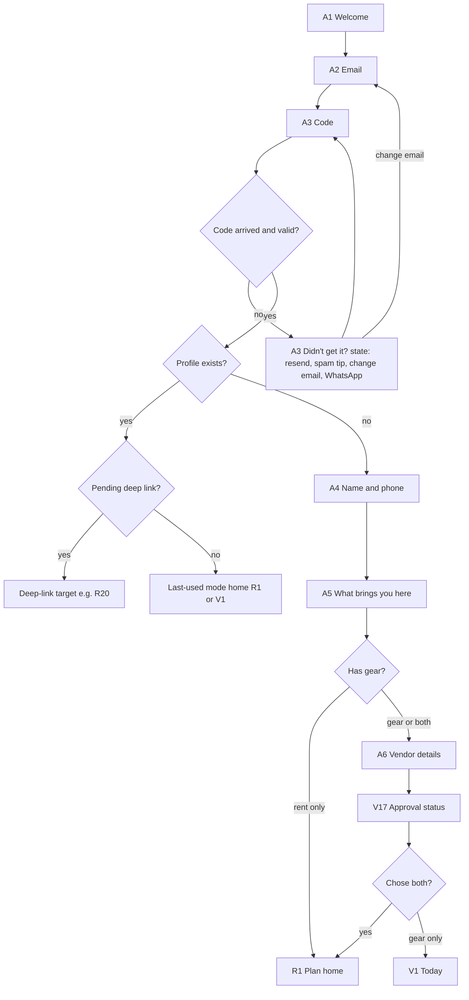

---

### F2. Plan by free text or voice

**Goal:** turn "outdoor crusade, about 2,000 people, we want to stream on YouTube" into a priced setup with the fewest extra questions.
**Entry points:** R1 start card (type or mic), an example chip on R1, "Plan an event" on R19 empty state, "Change answers" on R6.
**Exit:** R6 Your setup.

**Steps**
1. **R1 Plan home.** Text field plus a large mic button, example chips. Typing then Send, or tap the mic.
2. ◇ Voice? **Yes** → **R2 Voice listening sheet**: live transcript, waveform, Stop. On stop, transcript goes into the R1 field for a quick check (the user can fix "Ikeja" spelled "I kiss ya"), then Send. **No** → Send.
3. Parsing (≤ 2 s, inline on R1 as "Reading your event…").
4. **R4 Missing details.** Top: what we understood, as editable chips (Crusade · Open outdoor · ~2,000 · Livestream: YouTube). Below: only the missing **required** answers, inline as compact question cards. Required: event type, indoor/outdoor, crowd size, date, area. Optional (defaulted, shown as "We assumed…" chips): on stage, power, budget.
5. Tap a chip to correct it (opens that R3 question as a sheet and returns to R4).
6. "Size my setup" → **R5 Sizing** (thinking state, ~1 s, honest copy: "Sizing sound for 2,000 people outdoors… checking what's free on 14 Nov in Ikeja…").
7. → **R6 Your setup.**

**Decision points:** voice vs text; whether anything required is missing (if nothing is, skip R4 and go straight to R5).

**Unhappy paths**
- ⚠ **Mic permission denied.** R2 shows "Allow the microphone to talk to Deloo" with Open settings; the text field stays usable. Never ask again on every tap.
- ⚠ **No speech heard / too noisy** (church generator in background). After 8 s of silence: "We didn't catch that. Try again or type it."
- ⚠ **Offline.** Device speech-to-text may still work; parsing can't. Show "You're offline. We'll read your event when you're back online" and offer **R3 questions**, which work offline up to R5 (sizing rules run on the device; availability waits for the network).
- ⚠ **Parser can't understand it** ("abeg I need for Sunday"): go to R4 with everything empty and the message "Let's fill in the details", i.e. degrade to the question flow, never a dead end.
- ⚠ **Impossible or odd values** (crowd 200,000; date in the past): R4 highlights the chip: "Did you mean 2,000?"
- ⚠ **AI provider down.** Same as offline: fall back to R3.

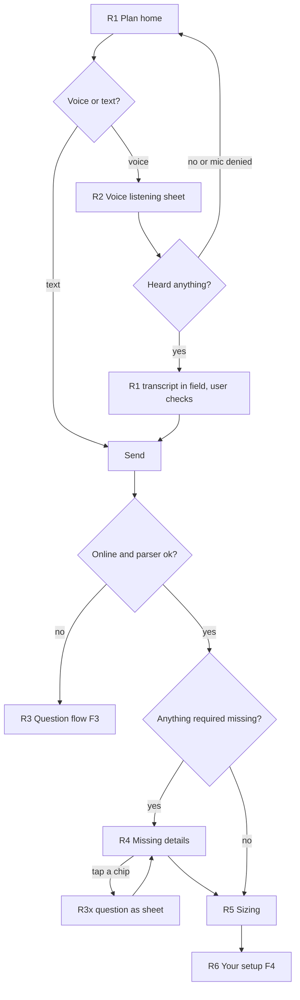

---

### F3. Plan by questions

**Goal:** a first-time planner who doesn't know what to ask for gets a complete setup by tapping, one question per screen.
**Entry points:** "Or answer a few quick questions" on R1; fallback from F2; "Change answers" on R6; resumed draft card on R1.
**Exit:** R6 Your setup.

**Steps** (progress bar on top; back arrow always; "Not sure" on every screen)
1. **R3a Event type.** Illustrated tiles: Service, Crusade/outdoor service, Conference, Wedding, Concert, Product launch, Party, Other. Auto-advance.
2. **R3b Venue.** Indoor / Covered outdoor / Open outdoor. ◇ Indoor → a second row appears on the same screen: Small room / Hall / Auditorium (for screen sizing). Auto-advance after the last tap.
3. **R3c Crowd size.** Slider with bands (<100, 100–300, 300–1,000, 1,000–3,000, 3,000+), big number, crowd illustration. Continue.
4. **R3d On stage.** Multi-select chips: Speakers only, Band, Choir, DJ, Panel. Continue. Smart default from R3a (Wedding → DJ preselected).
5. **R3e Livestream / recording.** None / Record only / Livestream (then platform chips: YouTube, Facebook, Instagram, Zoom). Auto-advance.
6. **R3f Power.** Grid (NEPA) / We have a generator / Nothing. Note under: "We always add surge protection." Auto-advance.
7. **R3g Date and time.** Native date sheet; start and end time; setup time in plain words ("Setup from 7am"). Multi-day toggle. Continue.
8. **R3h Area.** Lagos area chips (Ikeja, Lekki, Surulere…) or "Use my location"; optional venue name. Auto-advance.
9. **R3i Budget.** "Show me options" (default, big) / bands. Auto-advance.
10. → **R5 Sizing** → **R6 Your setup.**

**Decision points:** indoor sub-question (R3b); livestream platform (R3e). R3d is never skipped but is prefilled from R3a. Every question can be answered "Not sure".

**Unhappy paths**
- ⚠ **Date in the past / end before start:** inline error on R3g, Continue disabled.
- ⚠ **Same-day or next-morning event:** R3g warns "Short notice: fewer owners can confirm in time. We'll show what can." (also feeds the risk flag in PRD §4.5).
- ⚠ **Area outside launch zone** (Ibadan, Abuja): "We're only in Lagos for now. Join the list for your city" → *R29 waitlist variant*; plan stays saved.
- ⚠ **Offline:** questions work; R5 sizes on device, then shows R6 with availability chips as "Checking when online".
- ⚠ **User quits halfway:** draft saved; R1 shows "Continue your plan: Crusade · 14 Nov" with the step count.

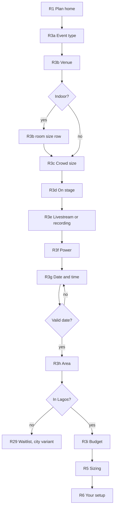

---

### F4. Compare and adjust the setup (why, swap, nothing available)

**Goal:** the renter understands and trusts the recommendation, fixes anything unavailable, and either books or shares it for approval.
**Entry points:** R5 (new plan); R1 "Continue your plan"; a shared link (deloo.space/s/…) opened on a phone with the app; R13 "Add to plan".
**Exits:** R15 Review booking (book), R10 Share to WhatsApp (approval loop), R1 (save for later).

**Steps**
1. **R6 Your setup.** Large total; deposit and Protection broken out beneath. Segmented control Good · Better · Best (opens on the level that fits the budget, else Better). Answer summary chips at top ("Crusade · Open outdoor · 2,000 · 14 Nov · Ikeja", tap to edit → R3x as sheet). Line items: photo, name, quantity, availability chip (Available / 1 left / Not available), **Why?** link, **Swap** link. Sticky bottom: Share · Book this setup.
2. **R7 Why?** Expands inline on the card (not a new screen): the plain reason and the rule behind it ("For 2,000 people in an open field, 4 tops and 2 subs so the back rows hear clearly").
3. **R8 Swap sheet.** Alternatives ranked per PRD §4.3: same item from another vendor → equivalent item → different approach → nearby date. Each with a one-line trade-off and price difference ("+₦15,000 · brighter in daylight"). Also "Remove from setup" at the bottom, with a warning if it's essential ("Without a generator your setup has no power").
4. ◇ Any line **Not available**? → the line shows the honest card; tapping it opens **R9 Nothing available state** (a sheet when one item is out; a full-screen state when the whole level is out).
5. **R9** says what's missing, confirms it was recorded ("We've noted it, so we can find more"), and offers: swap options (R8), a nearby date that works, the other level, or "Book what's free and find the rest yourself" (removes the line).
6. ◇ Book or share? **Share** → **R10 Share to WhatsApp**: preview of the message card (event, level, total, items, link), then the system share sheet. **Book** → F6.

**Unhappy paths**
- ⚠ **Availability changed since sizing** (someone booked the last unit): the chip flips with a short highlight and a toast "LED wall just got booked. Swap it?".
- ⚠ **Everything out** (December peak): R9 full state with nearby dates first, waitlist "Tell me if one frees up" (push when a unit is cancelled), and the WhatsApp support button ("Our team will look for you").
- ⚠ **Offline:** R6 shows cached prices with a "Prices and availability from 9:42" stamp; Book is disabled with "Connect to check it's still free"; Share still works (queues the link).
- ⚠ **Shared link opened by someone else** (the pastor): opens R6 read-only with "Make this my plan" (copies it into their account) or, without the app, the web page.

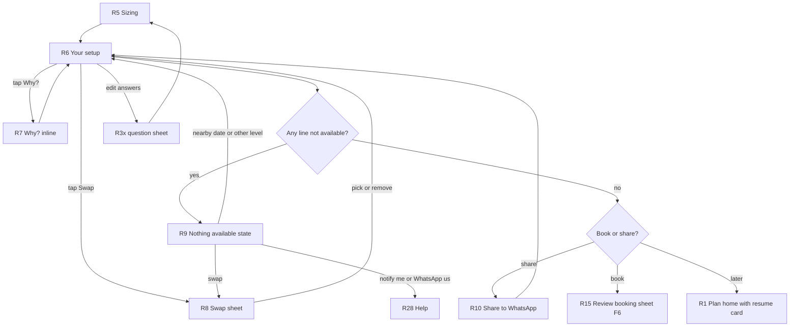

---

### F5. Explore → item → add to plan

**Goal:** a renter who knows what they want (Ada) finds a specific item free on a date, or a planner adds an extra item to a setup.
**Entry points:** Explore tab; "Explore gear" on R1; category tap on R6; vendor profile R14; a deep link to an item.
**Exits:** R6 (item added to a plan), R15 (book just this), back to R11.

**Steps**
1. **R11 Explore.** Search bar, category chips, a date+area pill at the top ("Any date · All Lagos"). Grid of gear cards (photo, name, day rate, vendor, availability for the chosen date). Coming-soon banner for ad space, crew, studios (→ R29).
2. **R12 Filters sheet.** Date, area, delivery, technician included, price band, verified vendors only. "Show 24 results" button.
3. **R13 Item detail.** Photo carousel, key specs as large figures, Why people rent it (event types), price per day, deposit, tier note ("Needs ID check: sound systems"), vendor card (→ R14), mini availability calendar, delivery/technician options. Sticky: **Add to plan**.
4. ◇ Has an active plan? **One plan** → added to it, toast "Added to Crusade · 14 Nov" with View. **Several** → *R30 Add to plan sheet (proposed)*: pick a plan or "Book just this". **None** → *R30* asks only date, time and area (R3g + R3h compact) and creates a "Quick booking" plan.
5. → **R6** (the item appears as a line marked "Added by you", no Why? reason) or → **R15** for "Book just this".
6. **R14 Vendor profile.** Verified badge, rating, response time ("Usually accepts in 40 min"), areas, delivery/technician, their gear grid. Tap an item → R13.

**Unhappy paths**
- ⚠ **No results for a filter:** "Nothing matches on 14 Nov in Lekki." Buttons: Remove filters, Try All Lagos, Nearby dates; logs unmet demand.
- ⚠ **Item not free on chosen date:** calendar shows next free dates; Add to plan is replaced by "Choose another date" or "Similar items" (→ R8-style list).
- ⚠ **Quantity higher than units free:** stepper caps at the free count, note "Only 2 free on 14 Nov. Add similar?"
- ⚠ **Slow images on 3G:** blurred low-res placeholders, then full images; grid is usable before photos load.
- ⚠ **Offline:** cached grid with stamp; availability chips greyed "Check when online".

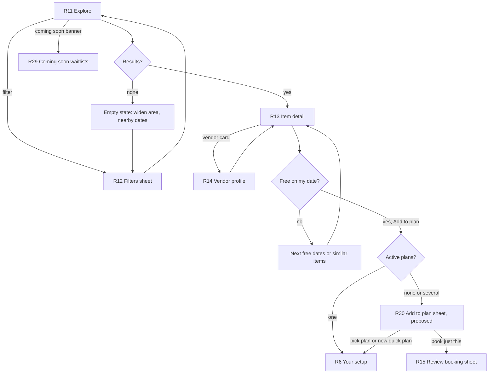

---

### F6. Book and pay (including the verification gate)

**Goal:** turn a setup into confirmed bookings with money paid safely and nothing double-booked.
**Entry points:** "Book this setup" on R6; "Book just this" on R30; "Pay now" on R20 (hold not yet paid); a "hold expiring" notification.
**Exits:** R18 success → R20 tracker; back to R6.

**Steps**
1. **R15 Review booking sheet** (full-height sheet). Grouped by vendor (one booking per vendor per event, PRD §6), each with items, dates, **Pickup or Delivery** toggle (delivery fee shown), **Technician** toggle (forced on and locked for tier-3 gear, with the reason). Protection in one line with a "What's covered" link. Cancellation policy in one line. Total, deposit (refundable) and rental split. Button: Continue to pay.
2. ◇ **Trust level ≥ highest item tier?** **Yes** → step 4. **No** → R16.
3. **R16 Verify identity gate.** "To rent sound systems, verify your identity. Takes about 2 minutes." Lists exactly what's needed for this tier (NIN or BVN, selfie; tier 2 adds address and deposit-or-guarantor; organisations add CAC). Provider SDK runs. ◇ Result:
   - **Passed** → returns to the flow at step 4 with the tier shown unlocked.
   - **Pending** (provider slow) → "We'll notify you within 30 minutes." Plan saved; no hold yet. Push lands on R15.
   - **Failed** → one retry with tips (light, glasses off, name must match NIN); then "Our team will check it with you" (WhatsApp, R28) and the option "Book only the gear you're verified for" (removes higher-tier lines).
4. **Hold placed** (30 min), visible as a countdown chip on R17.
5. **R17 Pay (Paystack).** Amount breakdown cards (rental, deposit with "back within 24 h of return", Protection, delivery, technician). Method: Bank transfer / Card / USSD. Card is recommended because it also saves the damage authorisation (tier 1 requirement). At the bottom: **R18 slide to confirm** ("Slide to pay ₦412,500"), which opens Paystack's secure sheet.
6. **R18 Success.** "Request sent to 2 owners. They'll confirm by 4:30pm. Your money is safe with Deloo until they do." Buttons: Track booking (→ R20), Share to WhatsApp (→ R10 booking variant).
7. Vendors accept (F13). Push "Sound City confirmed your LED wall" → R20.

**Decision points:** pickup vs delivery; technician (optional/locked); verification tier; payment method; payment result.

**Unhappy paths**
- ⚠ **Last unit taken during review** (race): R15 refreshes the line to Not available and offers R8 swap; the hold is placed only for what's free. Never charge for something we can't hold.
- ⚠ **Payment fails** (card declined, bank downtime, USSD timeout): R17 shows the reason in plain words and keeps the hold timer: "Your bank declined the card. Try transfer or another card. Your gear is held for 18 more minutes."
- ⚠ **Transfer sent but not yet confirmed:** R17 "Waiting for your bank (usually under 5 minutes)". The hold extends by 15 min once while a transfer is pending. If it lands after the hold has expired and the gear is gone, auto-refund within 24 h, and say so.
- ⚠ **Hold expires:** sheet "Your hold expired. Check it's still free?" → re-checks availability and returns to R15.
- ⚠ **App killed or offline after paying:** payment is confirmed server-side by webhook; on reopen, R19/R20 show the true state. R18 is never the only proof: a receipt email and SMS also go out.
- ⚠ **Vendor declines or doesn't answer in time** → rescue (see F13; renter sees it on R20 with *R32 Replacement offer (proposed)*).
- ⚠ **Payer name doesn't match account / same-day high-value order:** booking goes through but is flagged for Ops (PRD §4.5); renter sees "Our team may call to confirm" on R18, not a block.

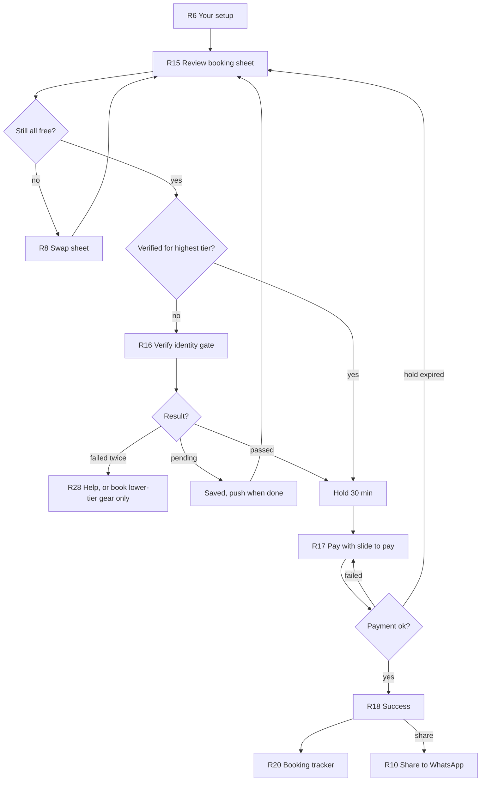

---

### F7. Event day: pickup or delivery handover

**Goal:** gear changes hands with photo evidence both sides agree on, even with no signal.
**Entry points:** day-before and morning-of push ("Pickup at 10am at Sound City, Ojota") → R20; R19 → R20; ongoing Android notification on event day.
**Exits:** R20 in "Out / Set up" state.

**Who does what (decision):** the **vendor side (owner or technician) shoots** the checklist on V12 because they know the gear; the **renter reviews and confirms** on R21 and may add their own photos. This halves the work compared with both sides shooting everything. For tier-3 gear (technician-run), the technician shoots at setup; the renter confirms "It's set up and working".

**Steps**
1. **R20 Booking tracker** (dark theme on event day): Confirmed → Ready for pickup / On the way → Handed over / Set up → Event → Collected / Returned → Deposit back. Each step has a time. Top card: today's action ("Pickup at 10:00 · Sound City, Ojota · Directions · Call · WhatsApp").
2. ◇ **Pickup or delivery?** Pickup: renter goes to vendor. Delivery: tracker shows "On the way" when the vendor taps Out for delivery on V2 (no live GPS map in v1; a call button is enough).
3. Vendor completes **V12 Handover checklist (vendor side)** per unit: guided camera frames (front, back, serial plate, accessories), condition, accessories count; checks "Surge protector / AVR connected" and (outdoor) "Covered setup".
4. **R21 Handover checklist (renter side)** opens from the tracker's "Check and confirm" button: swipe through the vendor's photos per unit; for each unit "Looks right" or "Something's off" (add a photo + note: "cracked panel corner already"). Then **slide to confirm handover**.
5. Tracker moves to **Handed over / Set up**. Renter's phone shows a sticky reminder of the return time.
6. During the event: R20 shows "Something's wrong?" → *R34 Problem sheet (proposed)*: gear not working, missing item, technician not here; routes to the vendor and Ops on WhatsApp with priority.

**Unhappy paths**
- ⚠ **Offline at venue (very common).** Checklist photos queue locally with a visible chip ("6 photos waiting to upload"). Confirmation works offline by **handover code**: the renter's R21 shows a 6-digit code generated from the booking (no network needed); the vendor types it into V12 (or the reverse). Both phones store signed confirmations and sync later. The tracker updates when either phone is back online.
- ⚠ **Renter disagrees with condition:** they can't block the handover; they confirm with notes and photos ("Accepted with notes"), which become evidence for F9.
- ⚠ **Vendor late or no-show:** at pickup time +30 min, R20 offers "Vendor not here?" → R34 → Ops calls the vendor; at +60 min rescue starts (as vendor cancellation, F13).
- ⚠ **Renter no-show** (see F13/V2): vendor marks no-show 2 h after the pickup slot from V2; renter gets a push and 30 min to respond before the cancellation policy applies.
- ⚠ **Power surge risk:** if "AVR connected" is not ticked, V12 won't let the vendor finish without a reason ("Renter refused"), and R21 shows a red line "No surge protector: you may be liable for power damage". This makes F9 decidable later.
- ⚠ **Phone dies / no camera:** checklist can be completed by the other side alone with "Renter not able to confirm"; Ops is notified; evidence weight drops (shown in F9).
- ⚠ **Rain at outdoor event:** day-before push for open-outdoor bookings: "Rain is forecast. Is your setup covered?" with link to add a canopy from the same vendor if listed.

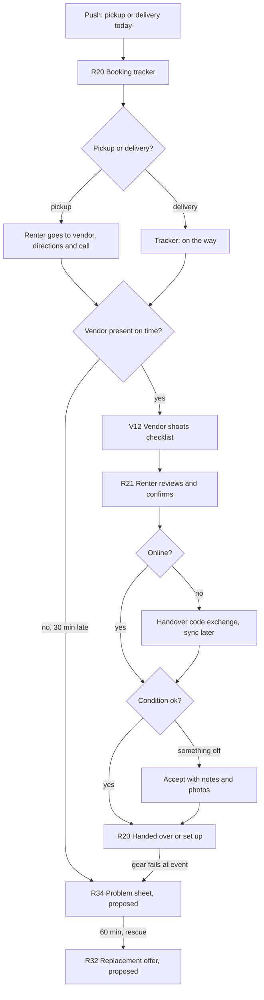

---

### F8. Return, deposit refund, rating

**Goal:** gear goes back, the deposit comes back quickly, both sides rate each other.
**Entry points:** return reminder push (2 h before return slot) → R20; R20 button "Start return".
**Exits:** R22 → R19 (booking closed); or F9 if a claim is raised.

**Steps**
1. **R20** shows "Return by 8pm today · Sound City, Ojota" (or "Collection at 9pm" for delivery bookings).
2. Vendor completes **V12 (return stage)**: same frames as pickup, shown side by side with the pickup photos so differences are obvious.
3. **R21 (return stage)**: renter reviews side-by-side photos, slides to confirm (or handover code offline).
4. ◇ **Vendor marks the return clean?** **Yes** → deposit refund starts; R20 shows "Deposit ₦150,000 on its way, by 9pm tomorrow". **Damage flagged** → F9 (deposit held, the rest of the timeline continues).
5. Push "Deposit refunded" → **R22 Rate vendor**: 1–5 stars, three quick chips (On time · Gear as described · Helpful technician), optional note. One screen, skippable. Vendor rates the renter on V2 at the same time.
6. Booking moves to Past on **R19**. R6 offers "Book this setup again" for repeat events (Sunday services, monthly programmes).

**Unhappy paths**
- ⚠ **Renter late returning:** at slot +1 h, push to renter "You're late returning. Late fee starts at 10pm (₦X per hour)"; vendor sees it on V1. At +24 h, Ops takes over (call, guarantor, blocklist per PRD).
- ⚠ **Vendor doesn't complete the return checklist** within 12 h: the deposit is refunded automatically and the vendor loses the right to claim (stated in vendor terms and on V2). Protects renters from deposits held hostage.
- ⚠ **Refund delayed by bank:** R20 shows the Paystack reference and "Banks can take up to 3 working days. Still missing after that? Chat with us."
- ⚠ **Renter returns an item short** (missing cable): vendor ticks the missing accessory in V12; small claim from the deposit (F9 fast path), renter sees the exact deduction and can dispute.

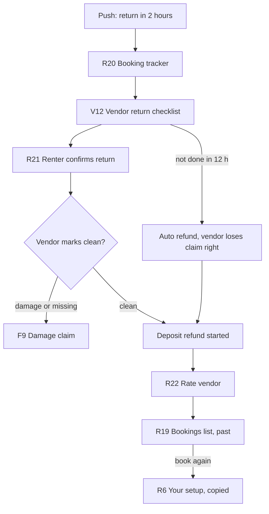

---

### F9. Damage claim and dispute

**Goal:** settle damage fairly, fast, using the handover evidence, and pay from the right layer (deposit → Protection → insurer).
**Entry points:** vendor on V12 return ("Report damage") or V2 within 24 h of return → V13; renter gets push "Sound City raised a claim" → R23.
**Exits:** claim settled (accepted, split, rejected) → R20 shows outcome; payouts adjusted on V14.

**Steps**
1. **V13 Raise damage claim.** Pick unit(s); app shows pickup vs return photos side by side; vendor adds close-up photos, picks damage type (cracked, not powering on, missing, water, burnt/surge), enters repair cost with a receipt or quote photo. Shows what the vendor can expect: "Up to ₦150,000 from the deposit; above that, Deloo Protection up to ₦X."
2. Renter is notified → **R23 Damage claim (renter view).** Same side-by-side evidence, the amount, and how it'd be paid ("₦60,000 from your deposit. Nothing extra"). Choices: **Accept**, **Dispute** (add photos, note, e.g. "LED panel corner was cracked at pickup, see my photo 3"), or **Ask a question** (WhatsApp with Ops, booking ref prefilled). 48 h to respond; silence = accepted (stated clearly with a countdown).
3. ◇ **Accepted** → deducted from deposit, remainder refunded, vendor paid. **Disputed** → Ops reviews (web console) within 72 h; both sides see "Under review by Deloo · decision by Thu 6pm" on R23/V13.
4. Ops decision shown on both: outcome, reasoning in one paragraph, money movements.
5. ◇ **Amount > deposit?** Protection covers above the deposit up to the cap; above the cap → insurer route (when signed) or charge to the saved card authorisation, only after a decision and with 24 h notice.

**Specific cases**
- **Power surge damage.** If V12 recorded "AVR connected" at handover and the event used grid or generator as declared, Protection pays; the renter pays nothing above the deposit excess. If AVR was refused by the renter, the renter is liable up to the deposit plus a capped amount. R23 shows which applies, citing the checklist entry.
- **Gear failed at the event (not renter's fault)** — renter-raised via R34: Ops can refund part of the rental and claw back from vendor payout (PRD §4.5 "clawback").
- **No pickup photos** (checklist skipped): claim goes straight to Ops; the side that skipped the checklist bears the doubt. Shown on V12/R21 as a warning before skipping.

**Unhappy paths**
- ⚠ Renter disputes and is unreachable: Ops decides on evidence after 72 h.
- ⚠ Vendor inflates cost: Ops asks for a repair quote; Protection pays the repairer directly where possible.
- ⚠ Renter refuses to pay beyond deposit: card authorisation charge; failing that, account blocked (shared blocklist) and guarantor contacted for tier 2.

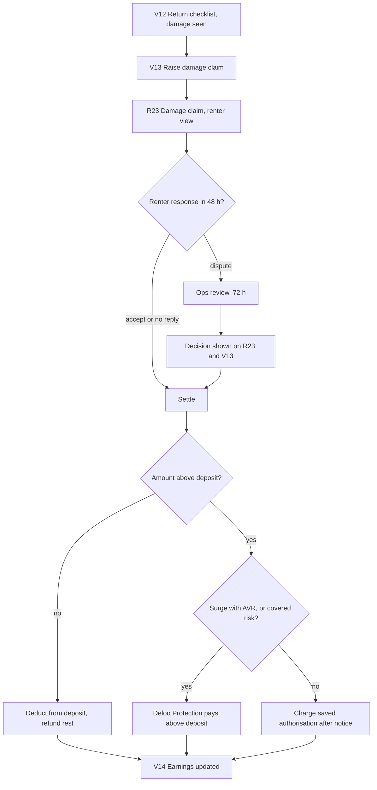

---

### F10. Vendor onboarding and approval

**Goal:** a gear owner gets from sign-up to visible, approved listings, and understands what Deloo checks and why.
**Entry points:** A5 "Rent out my gear"; R24 "Rent out your gear" (existing renter, F15); a vendor invite link from Ops.
**Exits:** V1 Today with "Approved" (gear visible).

**Steps**
1. **A6 Vendor details** (first run) or the same form reached from R24.
2. **V17 Approval status.** A checklist with live status, not a dead "pending" screen:
   - Your details ✓
   - ID check (owner's NIN) or CAC number for companies → in-app provider SDK (same as R16)
   - Payout account (→ V15)
   - At least one item listed (→ V6)
   - Deloo call and gear inspection (scheduled: "We'll call you by Friday" + a "Pick a time" chip; churches: letter or call from a church officer)
3. Vendor can list gear while pending (items saved as "Hidden until approved").
4. Ops approves → push "You're live. Renters can now book your gear." → **V1**, with first-time tips (how requests work, the 2 h accept rule).

**Unhappy paths**
- ⚠ **ID or CAC fails:** V17 shows which check failed and why, with retry and "Talk to us" (WhatsApp).
- ⚠ **Rejected** (e.g. couldn't verify ownership): V17 states reason and what to do; account stays as renter.
- ⚠ **Abandons midway:** V17 remains the vendor home until complete; V1 shows a progress card "3 of 5 done".
- ⚠ **Church as vendor:** prompts for a named responsible officer and a weekly blackout preset (Sunday) right here, routing to V10.

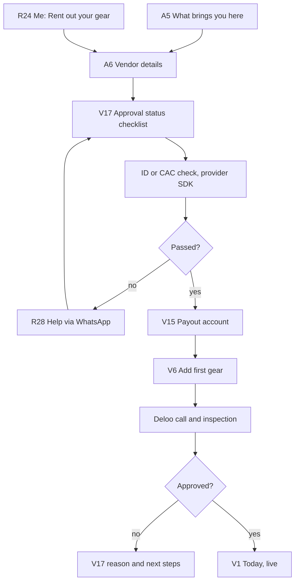

---

### F11. Vendor adds gear

**Goal:** an item listed with units, price, deposit and availability in under a minute.
**Entry points:** V5 "+ Add gear"; V17 checklist; empty V5; V1 tip.
**Exits:** V5 with the new item (live or hidden until approved/inspected).

**Steps**
1. **V6 Snap photo.** Camera with framing guide; "Choose from gallery" link. Up to 5 photos; first is the cover.
2. **V7 Confirm AI suggestion.** "Looks like a JBL EON715, 15-inch powered speaker." Category, brand, model, key specs (watts, size) prefilled; tap to edit; "Not this" → manual category picker. Condition chips.
3. **V8 Price and deposit.** Day rate with market hint ("Similar gear in Lagos rents for ₦20k–₦28k"). Replacement value (needed for the risk tier) → shows the tier result ("Tier 2: renters must pass ID and address checks") and a suggested deposit. Extras: delivery available, technician available (forced on for tier 3, explained). Shows "You'll receive ₦21,250 per day after Deloo's 15%."
4. **V9 Units.** Stepper "How many do you have?"; serial number per unit (camera reads the plate; "Add later" allowed for tier 1, required for tier 2–3).
5. **V10 Availability presets.** "Available every day" (default) / "Not on Sundays" / "Weekdays only" / Custom. Churches see "Not on Sundays" preselected.
6. Done → **V5 Gear list** with the item; toast "Live" or "Hidden until Deloo inspects it" (tier 3 always needs inspection).

**Unhappy paths**
- ⚠ **AI can't recognise it / offline:** V7 opens with an empty manual form (category grid first); photo is kept.
- ⚠ **Blurry or dark photo:** V6 rejects before upload ("Too dark: move to the light").
- ⚠ **Upload fails on bad data:** item saved as a local draft; V5 shows "Draft · uploading when online".
- ⚠ **Price far above market:** soft warning, never a block.
- ⚠ **Duplicate serial:** inline error on V9.

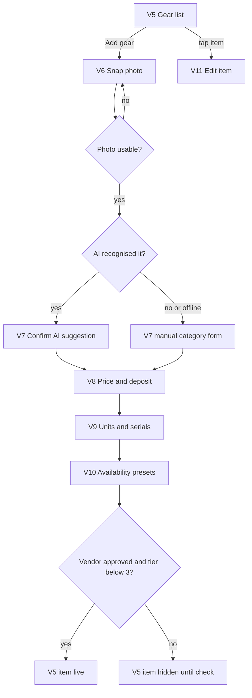

---

### F12. Vendor manages the calendar

**Goal:** availability in Deloo matches reality, including bookings taken on WhatsApp, so renters never book gear that's already out.
**Entry points:** Calendar tab; V11 "Availability"; V1 nudge "Got any bookings outside Deloo this week?"; Monday morning push "Block anything booked elsewhere".
**Exits:** V3 updated.

**Steps**
1. **V3 Calendar.** Month view; filter by item or "All gear"; each day shows booked (Deloo), blocked (own use / elsewhere), free. Tap a day → day list of units.
2. **V4 Block dates sheet.** Long-press and drag across days (or tap Block). Choose item(s) and how many units; reason chips: Booked elsewhere · Our own use · Repair. Repeat option (weekly).
3. ◇ Conflict with a Deloo booking? → sheet blocks it: "1 unit is booked by a Deloo renter on 14 Nov. To free it, you'd have to cancel (penalty applies)." Link to V2 for that booking.
4. **V10 Availability presets** reachable from V3's top menu for recurring rules.

**Unhappy paths**
- ⚠ **Offline:** blocks queue locally and apply on sync; if a renter booked meanwhile, vendor gets a conflict notice → V2 to resolve.
- ⚠ **Vendor forgets to block a WhatsApp booking** → leads to vendor cancellation (F13 rescue). Mitigation: weekly nudge plus the "Booked elsewhere" quick block on V1.

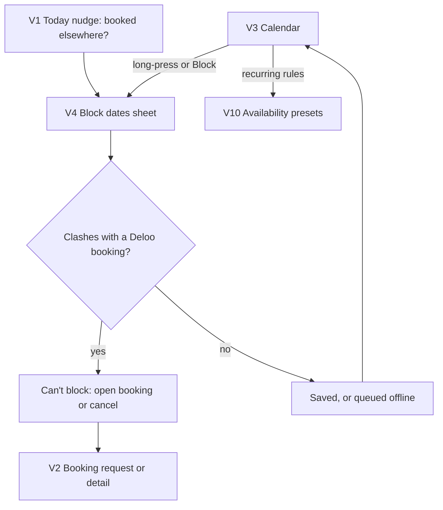

---

### F13. Vendor handles a request (and cancellation / rescue)

**Goal:** the vendor accepts or declines quickly with enough information about the renter; if anything fails, the renter is rescued automatically.
**Entry points:** push "New request: LED wall, 14 Nov, ₦350,000" → V2; V1 request card.
**Exits:** accepted (booking confirmed, renter's R20 updates), declined (rescue starts).

**Steps**
1. **V2 Booking request.** Items, dates, pickup or delivery address, what the vendor will receive (after commission), the deposit held, a countdown to the 2 h deadline. Renter card: name, verified tier badges, completed rentals, rating, event type and area (no BVN/NIN detail). Protection and payout timing explained in one line.
2. ◇ **Accept** (slide) → if technician is included, assign one (→ V18 list; "Assign later" allowed until the day before). Renter gets "Confirmed" push → R20.
3. **Decline** → reason chips (Not available after all · Too far · Date too close · Other). Gear auto-blocked on those dates if "Not available" (keeps the calendar honest).
4. After accept, V2 becomes the **vendor booking detail** for the booking's life: timeline, contact renter (call/WhatsApp), Start pickup checklist (→ V12), Mark out for delivery, Start return checklist, Report no-show, Rate renter, Raise claim (→ V13).

**Rescue (renter side), triggered by decline, timeout or vendor cancellation of a confirmed booking**
1. Ops is alerted; the system finds replacements (same item another vendor → equivalent → different approach).
2. Renter gets push "Sound City can't supply your LED wall. We found a replacement." → R20 with *R32 Replacement offer (proposed)*: the replacement, price difference (Deloo covers an increase up to a cap under the rescue guarantee), vendor rating. One tap Accept.
3. No replacement → full refund for that booking plus a credit, said plainly, with R28 for help.

**Unhappy paths**
- ⚠ **Vendor misses the deadline** → auto-decline, counts against the vendor's response score (shown on V1).
- ⚠ **Vendor cancels a confirmed booking** (V2 "Cancel booking"): shows the penalty and impact first ("Your renter's event is in 3 days. Cancelling costs ₦X and lowers your ranking"), requires a reason, slide to confirm.
- ⚠ **Renter no-show:** V2 "Renter didn't come" enabled 2 h after the pickup slot → renter has 30 min to respond → then the cancellation policy pays the vendor, and the gear is freed.
- ⚠ **Renter cancels:** vendor is notified on V1 with what they still receive under the policy.

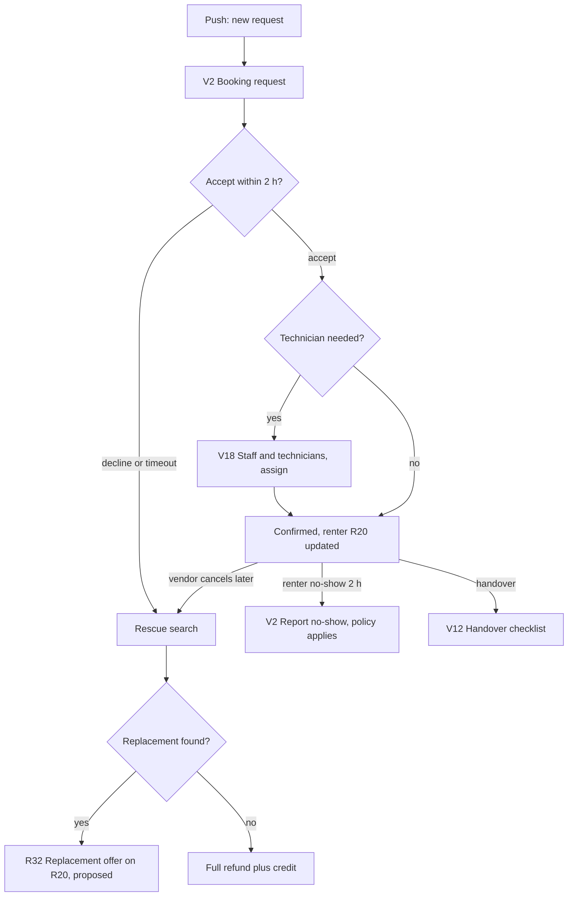

---

### F14. Vendor payout

**Goal:** the vendor knows exactly what they've earned, what's coming and when, and gets paid to the right account.
**Entry points:** Earnings tab; push "₦212,500 paid to GTBank ••4521"; V17 checklist (first payout account).
**Exits:** V14.

**Steps**
1. **V14 Earnings.** Hero number "Coming to you: ₦612,500". Below: list by booking with status (Upcoming · In progress · Paid · On hold: claim). Each row: rental, commission, net, date. Deposits held are shown separately and labelled "Renter's money, not yours" to avoid confusion.
2. **V15 Payout account.** Bank picker, account number → name resolved automatically (Paystack resolve) and must match the vendor/owner name or CAC name; mismatch goes to Ops review.
3. Payout is released when the return checklist is done (rental part); claim money follows the F9 decision.

**Unhappy paths**
- ⚠ **No payout account yet:** V14 banner "Add your bank to get paid" → V15; earnings accrue.
- ⚠ **Transfer failed (bank down / account closed):** row shows "Failed: we'll retry tomorrow" or "Update your account".
- ⚠ **Changing the payout account:** requires a fresh code to the owner's phone/email and a 24 h cooling-off (fraud protection), stated on V15.
- ⚠ **Staff member (V18) opens Earnings:** hidden for staff role.

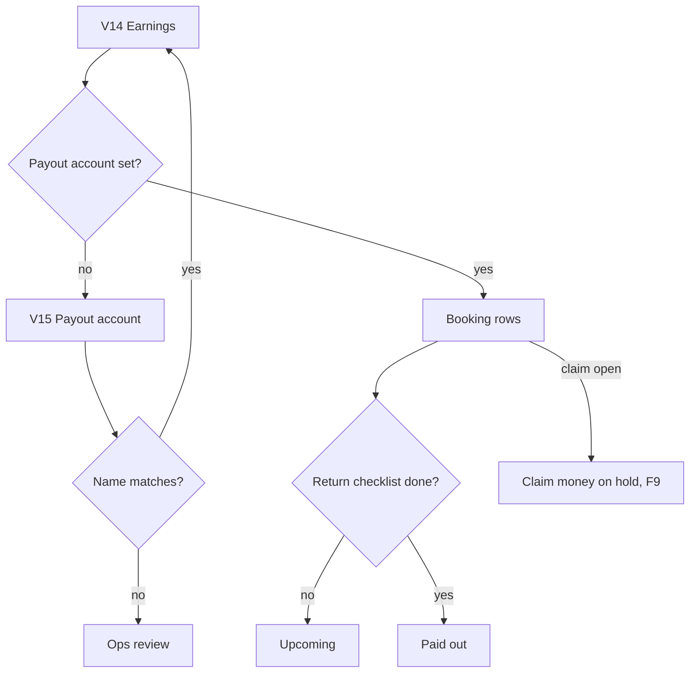

---

### F15. Mode switch renter ↔ vendor

**Goal:** a person who both rents and owns gear (a church, a DJ) moves between modes without confusion.
**Entry points:** R24 / vendor Me "Switch to …" card; long-press the Me tab; a notification for the other mode; "Rent out your gear" on R24 for renters without a vendor.
**Exits:** the other mode's home (R1 or V1) or the notification target.

**Steps**
1. **R24 Me** → card "Switch to Sound City Rentals" → full-screen fade with the vendor's name (1 s, so the user sees the context changed) → **V1**.
2. Vendor Me (shares R24 layout) → "Switch to renting" → **R1**.
3. ◇ No vendor yet? R24 shows "Rent out your gear" → **A6** → **V17** (F10).
4. Notifications for the other mode switch automatically, with a toast, and Back returns to the previous mode.

**Unhappy paths**
- ⚠ **Staff-only user** (a technician invited to a vendor) sees vendor mode limited to V1, V2, V12; Earnings and V15 hidden.
- ⚠ **Mid-task switch** (half-filled V8): draft is saved; switching back resumes.

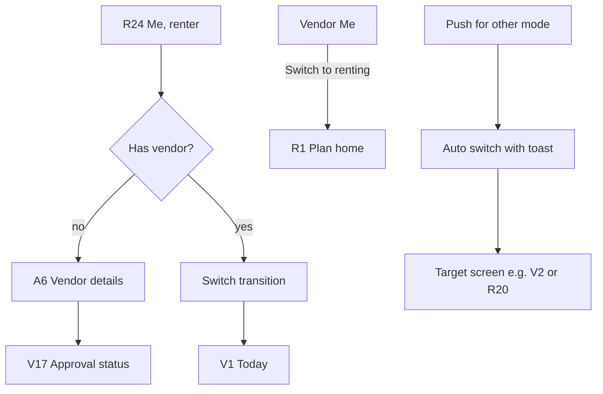

---

### F16. Coming-soon waitlist

**Goal:** capture real demand for ad space, crew and studios (and other cities) in under 20 seconds.
**Entry points:** Explore banner; R24 "Coming soon"; R3h outside-Lagos; deloo.space waitlist links.
**Exits:** confirmation, back to where they came from.

**Steps**
1. **R29 Coming soon waitlists.** Three cards (Ad space · Media crew by the hour · Studio space). Tap one → expands to a 3-field form: what (chips), where (area, prefilled), when (month). Name and phone prefilled from profile.
2. Join → "You're on the list. We'll WhatsApp you when it opens." Card shows "Joined ✓".

**Unhappy paths:** offline → queued and marked "Will send when online". Duplicate → "You're already on this list" with option to update details.

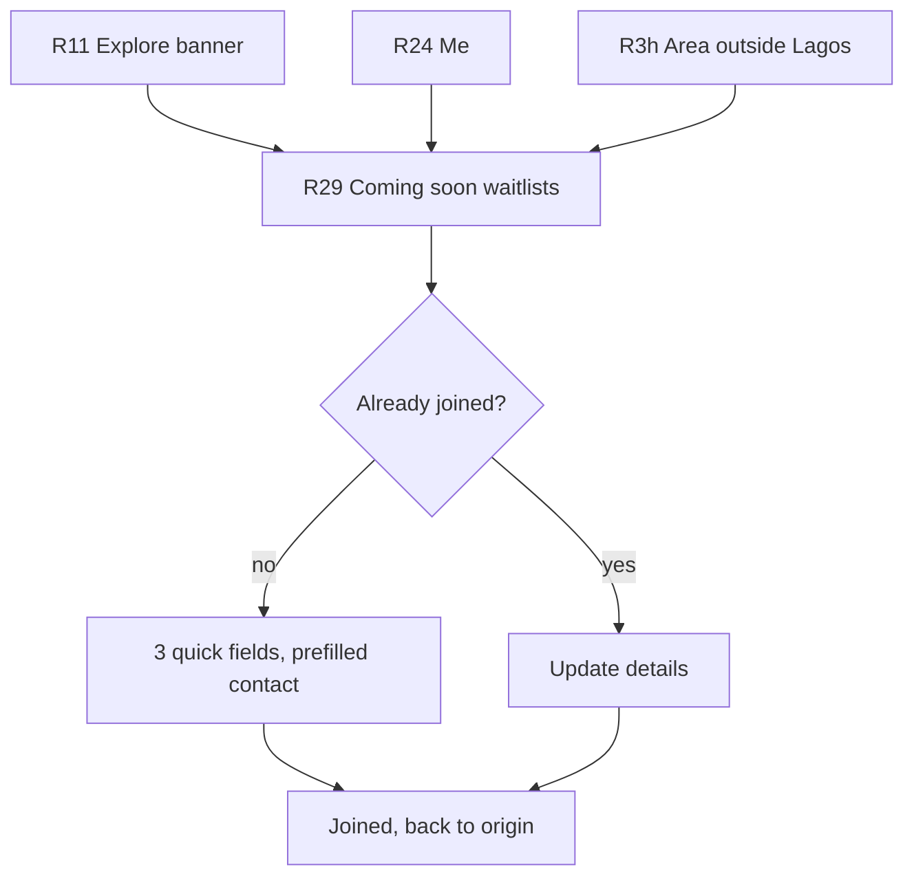

---

### F17. Account, verification tiers, help

**Goal:** users see their trust level, manage payment and notification settings, and reach a human fast.
**Entry points:** Me tab; R16 "Learn more"; any Help button.
**Exits:** back to Me.

**Steps**
1. **R24 Me.** Name, phone, mode switch card, verification summary ("Verified for: small gear ✓ · sound systems ✓ · LED walls 🔒"), rows: Verification, Payment methods, Notifications and settings, Help, Coming soon, Sign out.
2. **R25 Verification tiers.** Three tier cards with what each unlocks and what it needs; "Verify now" on the next locked tier (same SDK as R16, not tied to a booking). Shows trust growth: "2 more clean rentals lower your deposits."
3. **R26 Payment methods.** Saved cards (Paystack authorisation), default method, remove card (warn if an active booking depends on it).
4. **R27 Notifications and settings.** Push categories, SMS fallback for event-day alerts (for people who switch data off), data saver (lower-res photos), language (English; Pidgin later), theme, delete account (blocked while a booking or claim is open, with reason).
5. **R28 Help.** WhatsApp chat (prefilled with the current booking ref if opened from a booking), call button (works without data), short FAQ (deposits, Protection, cancellation).

**Unhappy paths:** WhatsApp not installed → open wa.me in the browser or call. Delete account with open booking → explain and link to R20.

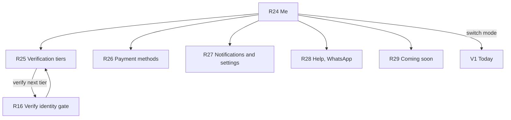

---

## 4. Master navigation map and deep links

### 4.1 Structure

- **Renter tabs:** Plan (R1) · Explore (R11) · Bookings (R19) · Me (R24).
- **Vendor tabs:** Today (V1) · Calendar (V3) · Gear (V5) · Earnings (V14) · Me (vendor variant of R24, links V15–V18).
- **Sheets:** R2, R3x (when editing from R4/R6), R8, R9 (single item), R10 (preview), R12, R15, *R30*, *R32*, *R34*, V4.
- **Full screens:** everything else. **System/transient:** R5 Sizing, R7 (inline expansion), R18 success, R17's Paystack sheet (third-party).

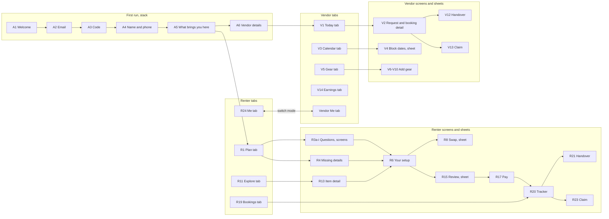

### 4.2 Deep link scheme

| Link | Lands on | If signed out | If app not installed |
|---|---|---|---|
| `deloo.space/s/{setupId}` (shared setup) | R6 read-only, "Make this my plan" | A1 → sign-in → R6 | Web page of the setup with "Get the app" |
| `deloo.space/b/{bookingId}` | R20 (party) or "Not your booking" | A1 → sign-in → R20 | Web status page (party only, after code) |
| `deloo.space/i/{itemId}` | R13 | A1 → sign-in → R13 | Web item page |
| `deloo.space/v/{vendorId}` | R14 | A1 then R14 | Web vendor page |
| `deloo.space/join/vendor?ref=` | A6 (or R24 → A6) | A1 → … → A6 | Play Store |
| `deloo.space/waitlist/{vertical}` | R29 with that card open | R29 needs sign-in | Web waitlist form |

### 4.3 Notification landing table

| Notification | Who | Lands on | Mode switch? |
|---|---|---|---|
| Sign-in code (email/SMS) | any | A3 (autofill / paste) | — |
| Verification passed / failed / pending done | renter | R15 if a booking is waiting, else R25 | — |
| Hold expiring in 5 min | renter | R17 | — |
| Payment received | renter | R20 | — |
| Vendor accepted | renter | R20 | — |
| Vendor declined / cancelled / replacement found | renter | R20 with *R32* open | — |
| Day before / morning of event, pickup or delivery soon | renter | R20 (ongoing Android notification on the day) | — |
| Confirm handover | renter | R21 | — |
| Return due in 2 h / late | renter | R20 | — |
| Deposit refunded | renter | R22 | — |
| Damage claim raised / decision | renter | R23 | — |
| Unavailable item freed up ("notify me") | renter | R6 with the item highlighted | — |
| New request (with countdown) | vendor | V2 | yes |
| Request about to expire (30 min left) | vendor | V2 | yes |
| Renter cancelled | vendor | V2 | yes |
| Pickup / delivery today | vendor | V1 | yes |
| Return overdue / checklist not done | vendor | V2 | yes |
| Claim response / decision | vendor | V13 | yes |
| Payout sent / failed | vendor | V14 | yes |
| You're approved / check failed | vendor | V17 (approved → V1) | yes |
| Waitlist vertical opened | any | R29 | — |

---

## 5. Screen inventory with states

Type: **tab**, **screen** (full screen), **sheet** (bottom sheet), **system** (transient / overlay / inline). "Offline" means behaviour without network. Every screen also needs large-font (200%) and dark-mode checks; not repeated per row.

| ID | Screen | Type | Reached from | Leads to | States needed | Notes |
|---|---|---|---|---|---|---|
| A1 | Welcome | screen | install, sign-out, signed-out deep link | A2 | default, reduce-motion (static word) | Built. One CTA. |
| A2 | Email | screen | A1, A3 "change email" | A3 | empty, invalid, typo suggestion, sending, rate-limited, offline | Pilot: phone number. |
| A3 | Code | screen | A2, code push | A4, last mode, deep-link target | waiting (timer), didn't get it, wrong code, expired, locked (5 fails), verifying, offline | Auto-submit on 6 digits. |
| A4 | Name and phone | screen | A3 (no profile) | A5 | empty, invalid phone, saved draft | Pilot: name only. |
| A5 | What brings you here | screen | A4 | R1, A6 | none selected, selected, saving, error | "Both" is a link. |
| A6 | Vendor details | screen | A5, R24, vendor invite link | V17 | empty, partial, name taken, saving, offline-saved, error | Church → officer + Sunday preset. |
| R1 | Plan home | tab | tab, A5, R19 empty, R6 "later" | R2, R3a, R4, R5, R6 (resume), R11 | first-time (examples), resume-draft card, upcoming-booking card, parsing, offline | Built (start card only). |
| R2 | Voice listening sheet | sheet | R1 mic, R4 mic | R1 (transcript) | permission ask, denied, listening, no speech, transcribing, error | Device speech-to-text first. |
| R3a–R3i | Question flow | screen (sheet when editing) | R1, F2 fallback, R4/R6 chip edit | next question, R5 | unanswered, selected, "not sure", validation (R3g), out-of-area (R3h), short-notice warning (R3g) | Auto-advance on single choice. |
| R4 | Missing details | screen | R1 send | R3x sheet, R5 | parsed-all (skip), partial, nothing understood, odd value warning | Understood chips + missing cards. |
| R5 | Sizing | system | R3i, R4, edits on R6 | R6 | sizing, checking availability, offline (sized, availability pending), error → retry | ~1 s, honest copy. |
| R6 | Your setup | screen | R5, R1 resume, R13/R30, shared link | R7, R8, R9, R10, R15, R3x | loading skeleton, full, partial availability, all unavailable, stale prices (offline), read-only (shared), item changed toast | Core screen. |
| R7 | Why? | system (inline) | R6 line | R6 | collapsed, expanded | No new screen. |
| R8 | Swap sheet | sheet | R6, R9, R15 | R6 | loading, list, no alternatives, essential-item remove warning | Ranked per PRD §4.3. |
| R9 | Nothing available state | sheet (one item) / screen (whole level) | R6 | R8, R6, R28 | single item, whole setup, notify-me set, peak-season variant | Logs unmet demand. |
| R10 | Share to WhatsApp | sheet | R6, R18, R20 | system share | preview, generating link, offline (queued), WhatsApp missing | Also booking variant. |
| R11 | Explore | tab | tab, R1 | R12, R13, R29 | loading skeleton, grid, empty filter, error, offline cached, slow images | Built (basic grid). |
| R12 | Filters sheet | sheet | R11 | R11 | default, active filters count, zero-result preview | |
| R13 | Item detail | screen | R11, R14, deep link | R14, R30, R6, R15 | loading, available, limited, not free on date, tier-locked note, offline | Shared-element from card. |
| R14 | Vendor profile | screen | R13, R6 line, deep link | R13 | loading, new vendor (no ratings), error | |
| R15 | Review booking sheet | sheet | R6, R30 | R16, R17, R8 | loading, ready, item lost (race), tier-locked lines, multi-vendor, offline (disabled) | Delivery/technician toggles. |
| R16 | Verify identity gate | screen | R15, R25 | R17, R15, R28 | intro, in SDK, pending, passed, failed (retry), failed twice | Copy per tier. |
| R17 | Pay (Paystack) | screen | R15, R16, hold push, R20 | R18 | method select, slide ready, processing, declined, transfer pending, hold expiring, hold expired | Slide-to-pay lives here (see §8). |
| R18 | Slide to confirm + success | system | R17 | R20, R10 | success (awaiting vendor), success (instant confirm), flagged for Ops call | |
| R19 | Bookings list | tab | tab, R22 | R20, R6 (book again) | empty, upcoming, past, loading, offline cached | Built (empty). |
| R20 | Booking tracker | screen | R18, R19, pushes, deep link | R21, R23, R28, R10, *R31*, *R32*, *R34* | each lifecycle step, awaiting vendor, rescue offer, cancelled, disputed, refund pending, offline cached, event-day dark | Ongoing notification on event day. |
| R21 | Handover checklist (renter) | screen | R20, push | R20 | pickup/return stage, loading photos, review per unit, accept with notes, offline (handover code), waiting for vendor, done | Renter reviews vendor's photos. |
| R22 | Rate vendor | screen | deposit-refunded push, R20 | R19 | empty, rated, skipped | One screen. |
| R23 | Damage claim (renter) | screen | push, R20 | R28, R20 | new (countdown), accepted, disputed, under review, decided, paid | Side-by-side evidence. |
| R24 | Me | tab | tab | R25–R29, mode switch, A6 | renter only, renter+vendor, staff, offline | Built (basic). |
| R25 | Verification tiers | screen | R24, R16 | R16 | each tier locked/unlocked/pending, trust-growth hint | |
| R26 | Payment methods | screen | R24, R17 | R17 (add) | none, saved cards, removing (blocked by booking) | |
| R27 | Notifications and settings | screen | R24 | — | default, permission denied (push), delete blocked | SMS fallback, data saver. |
| R28 | Help | screen | everywhere | WhatsApp, phone | default, with booking context, WhatsApp missing | Call works without data. |
| R29 | Coming soon waitlists | screen | R11, R24, R3h, deep link | origin | not joined, joined, queued offline, city variant | |
| V1 | Today | tab | tab, mode switch, approval push | V2, V12, V4, V5, V17 | not approved (progress), nothing today, requests waiting, pickups/returns today, overdue, offline | Built (empty). |
| V2 | Booking request (and booking detail) | screen | push, V1, V3 | V18, V12, V13, V4 | request (countdown), expired, accepted, declined, cancelled by renter, out, returned, no-show, closed, offline | See §8 (broadened). |
| V3 | Calendar | tab | tab | V4, V10, V2 | loading, empty (no gear), month with bookings/blocks, item filter, offline queued blocks | Built (placeholder). |
| V4 | Block dates sheet | sheet | V3, V1, V11 | V3 | selecting, conflict, saved, queued offline | Reason chips. |
| V5 | Gear list | tab | tab | V6, V11 | empty, list, hidden/draft/uploading items, loading, offline | Built (list). |
| V6 | Add gear: snap photo | screen | V5, V17 | V7 | camera permission, framing, too dark/blurry, captured, gallery | |
| V7 | Add gear: confirm AI suggestion | screen | V6 | V8 | analysing, suggestion, low confidence, manual form (offline/failed) | |
| V8 | Price and deposit | screen | V7, V11 | V9 | empty, market hint, tier result, above-market warning | Shows net after commission. |
| V9 | Units | screen | V8, V11 | V10 | count, serial scan, duplicate serial, "add later" | Serials required tier 2–3. |
| V10 | Availability presets | screen | V9, V3, V11 | V5 | default, church preset, custom | |
| V11 | Edit item | screen | V5 | V8, V9, V10, V4 | loading, edit, hide/unhide, active bookings warning, saving | |
| V12 | Handover checklist (vendor) | screen | V2, V1 | R21 (other phone), V13 | per-unit guided camera, serial read, AVR/cover checks, offline queue, handover code entry, renter absent | Pickup and return stages. |
| V13 | Raise damage claim | screen | V12, V2 | V14 | drafting, submitted, renter accepted, disputed, under review, decided | Within 24 h of return. |
| V14 | Earnings | tab | tab, payout push | V15, V2 | empty, upcoming, paid, on hold (claim), failed payout, no account banner | Built (zero card). Hidden for staff. |
| V15 | Payout account | screen | V14, V17 | V14 | empty, resolving name, mismatch, saved, change cooling-off | |
| V16 | Vendor profile edit | screen | vendor Me | — | edit, saving, error | Photos, areas, delivery, technician. |
| V17 | Approval status | screen | A6, V1, vendor Me, push | V15, V6, R28 | checklist progress, check failed, call scheduled, approved, rejected | Not a dead "pending" page. |
| V18 | Staff and technicians | screen | vendor Me, V2 assign | V2 | empty, list, invite pending, assign mode | Staff get limited vendor mode. |

---

## 6. Prioritisation

**Demo (~22 Oct 2026):** planner, Explore and basic vendor gear are real; booking is a clickable flow with no real money (Paystack test mode or a mock sheet), clearly labelled "Demo".

| Phase | Screens | Notes |
|---|---|---|
| **Demo (must)** | A1–A6 (built), R1, R3a–R3i, R4, R5, R6, R7, R8, R9, R10, R11 (built, add date pill), R13, R15, R17 (mock), R18, R19, R20 (mocked lifecycle), R24 (built), V1 (built), V5 (built), V6, V7, V8, V9, V17 | The demo story: "outdoor crusade, 2,000, livestream" → setup → honest unavailable + swap → share to WhatsApp → book (mock) → tracker; then switch to vendor and add a speaker from a photo. |
| **Demo (if time)** | R2 voice (device speech-to-text), R12 (date + category only), R14, V3 read-only, V4, V10, R29 (link to web waitlist) | Voice is the wow moment but risky on stage: keep typed text as the scripted path. |
| **Pilot launch (N4–N6)** | R16, R17 live, R21, R22, R23, R25, R26, R27, R28, R29 native, V2, V3, V4, V10, V11, V12, V13, V14, V15, V16, *R30*, *R31*, *R32*, *R34*, phone OTP versions of A2/A3/A4 | Nothing involving real money or gear ships without R21/V12, R16 and R28. |
| **Later** | V18 (until vendors with several technicians join; owner does handovers in the pilot), *R35 inbox*, Pidgin voice, live delivery map, "ask for approval" flow for church admins, organisation accounts (CAC), web vendor dashboard | |

---

## 7. Top 10 UX risks and assumptions to validate

Test with 8–10 church media leads (Ikeja, Surulere, Lekki; mix of Pentecostal, Catholic, Anglican), 3 event planners, and 6 vendors (3 companies, 2 churches, 1 individual). Use the demo APK on the participant's own phone where possible.

| # | Assumption / risk | 1-line test |
|---|---|---|
| 1 | Renters will trust Deloo's recommended setup over their usual vendor's advice. | Show 5 media leads the R6 setup for their last special programme; ask "Would you book exactly this? What would you change?" and count edits. |
| 2 | Free text/voice is faster and preferred over the question flow. | Give 6 participants the same brief, half start with text/voice, half with questions; time to R6 and preference afterwards. |
| 3 | The planner is not the payer; the WhatsApp share (R10) is what gets approval. | Ask 8 media leads to walk through how their last rental was approved; then watch whether the R10 card has what their pastor/admin needs (total, deposit, vendor). |
| 4 | Renters will pay upfront and wait up to 2 h for vendor confirmation. | Fake-door on R18 copy variants ("pay now, confirmed by 4:30pm" vs "request first, pay after confirm"); ask which they'd do and why. |
| 5 | Renters will complete NIN/BVN + selfie for sound systems (tier 1–2) without abandoning. | Clickable R16 with real copy; measure willingness and ask what makes them stop (BVN fear is the hypothesis). |
| 6 | Card is acceptable as the default payment (needed for damage authorisation); many prefer transfer. | Ask 10 renters how they paid their last 3 rentals; show R17 and note the first method they tap. |
| 7 | Vendors will keep the Deloo calendar accurate when most bookings still come via WhatsApp. | Ask 6 vendors to block last month's real bookings in V3/V4; time it, and ask how they'd remember to do it weekly. |
| 8 | Vendor-shoots / renter-confirms checklist is fast enough at a dark, busy venue with no signal. | Run V12+R21 on 2 real pickups (airplane mode, evening) with a vendor's technician; time per unit and errors. |
| 9 | Vendors accept 10–15% commission plus held deposits and payout after the return checklist. | Show V8's "You'll receive ₦21,250" and V14 with real numbers to 6 vendors; ask "Would you list your LED wall at this?" |
| 10 | Deposit + Protection wording ("damage waiver", not insurance) is understood and trusted. | 5-second test of R15's Protection line, then ask the participant to explain who pays if a speaker blows from a power surge. |

Also watch (not top 10): email code deliverability on Nigerian Gmail/Yahoo accounts in the demo; small text on itel screens; whether churches as vendors need board sign-off flows.

---

## 8. Proposed changes to the inventory

> **Reconciled 9 Oct 2026** with the UI designer's proposals: the final list is `docs/ux/inventory.md`. Only change here: the activity inbox is **R35** (not R33).

Original IDs are unchanged. Additions take the next free number.

| Change | Proposal | Why |
|---|---|---|
| **Add R30** | **Add to plan sheet.** From R13: choose an existing plan, start a quick plan (asks date, time, area only), or "Book just this". | Explore has no path into booking without it. |
| **Add R31** | **Cancel booking sheet (renter).** Shows refund breakdown under the policy before a slide to cancel. | Cancellation is in the PRD lifecycle but has no screen. |
| **Add R32** | **Replacement offer sheet** (rescue). Opens on R20 when a vendor declines, times out or cancels: the replacement, price difference covered, Accept / Refund instead. | Makes the rescue guarantee visible and one tap. |
| **Add R35** (was R33; renumbered in `inventory.md`) | **Activity inbox** (both modes; bell on R1 and V1). | Users who turn data off miss pushes; a list of recent updates. Later phase. |
| **Add R34** | **Something's wrong sheet** (both modes from R20/V2): vendor late, gear not working at event, renter no-show, missing item; routes to WhatsApp with priority and can start rescue. | Event-day failures need a faster path than R28. |
| **Broaden V2** | Rename to **"Booking request / booking detail (vendor)"**; after accept it is the vendor's view of the booking for its whole life. | The inventory has no vendor booking detail; one screen with states beats two. |
| **Clarify R18** | Slide-to-pay sits at the bottom of **R17** (before the charge); **R18 is the success state** only. | A slide after Paystack has already charged is pointless; one fewer step. |
| **Clarify R7** | Inline expansion on R6, not a separate screen. | Fewer screens; keeps context. |
| **Clarify R3b** | Includes the indoor room-size row (PRD "venue size"). | Needed for screen sizing; avoids an extra question. |
| **Move technician question** | PRD's "Technician yes/no" is a toggle on **R15**, not a question in R3. | Shorter question flow; the answer only matters at booking. |
| **R29 variant** | Adds a "your city" list (from R3h outside Lagos). | Captures expansion demand with no new screen. |
| **Vendor Me** | Vendor mode's Me tab reuses **R24** layout with vendor rows (V15–V18). Keep one ID (R24) with a vendor variant rather than a new V ID. | Shared component; the N0 code already does this. |
